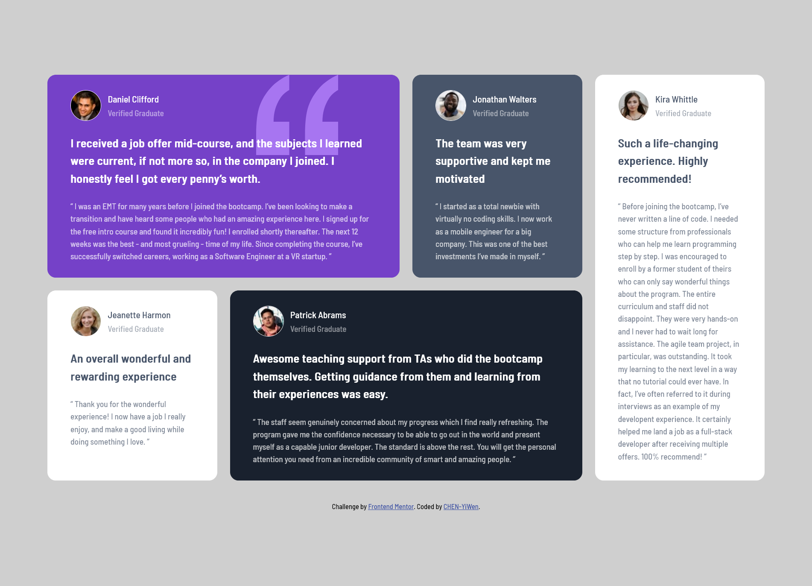

# Frontend Mentor - Testimonials grid section solution

This is a solution to the [Testimonials grid section challenge on Frontend Mentor](https://www.frontendmentor.io/challenges/testimonials-grid-section-Nnw6J7Un7). Frontend Mentor challenges help you improve your coding skills by building realistic projects. 

## Table of contents

- [Overview](#overview)
  - [The challenge](#the-challenge)
  - [Screenshot](#screenshot)
  - [Links](#links)
- [My process](#my-process)
  - [Built with](#built-with)
  - [What I learned](#what-i-learned)
  - [Continued development](#continued-development)
  - [Useful resources](#useful-resources)
- [Author](#author)
- [Acknowledgments](#acknowledgments)

**Note: Delete this note and update the table of contents based on what sections you keep.**

## Overview

### The challenge

Users should be able to:

- View the optimal layout for the site depending on their device's screen size

### Screenshot

### Links

- Solution URL: [Github](https://github.com/CHEN-YiWen/Testimonials-grid-section)
- Live Site URL: [Add live site URL here](https://your-live-site-url.com)

## My process

### Built with

- Semantic HTML5 markup
- CSS custom properties
- CSS Grid
- Flexbox
- Mobile-first workflow

### What I learned

- This is my first time learning how to use <code>display: grid</code>. After watching Kevin Powell's video, I think I have grasped the basic idea of it. I highly recommend his videos.

- I was not sure about whether I should put each testimony into <code>section</code> or <code>article</code>. After reading some materials, I considered the testimonies were more like blog posts or user comments. Therefore, I put them into <code>article</code>. 

- I also used <code>cite</code> and <code>blockquote</code> in the HTML. I believe they can make the code more semantic.

### Continued development

- I use <code>grid-column</code>, <code>grid-column-start</code>, <code>grid-column-end</code>, <code>grid-row-start</code>, and <code>grid-row-end</code> for the layout. Next time I want to switch to <code>grid-template-areas</code>, which will simpliy my code a lot.

### Useful resources

- [Learn CSS Grid the easy way](https://www.youtube.com/watch?v=rg7Fvvl3taU&t=1515s) - Kevin Powell's video is fanstic for beginners like me who stuggle with using grid. By following this video step by step, I get to understand the basics about <code>display: grid</code> and how to properly use it in this challenge.
- [article: The Article Contents element](https://developer.mozilla.org/en-US/docs/Web/HTML/Element/article) - This helped me to understand when and how to use <code>article</code>.
- [7 Alternatives to the div HTML Tag](https://medium.com/@zac_heisey/7-alternatives-to-the-div-html-tag-7c888c7b5036) - I find that I constatnly refer back to Zac Heisey's article when I am not sure about whether I should put the contents into a <code>div</code>. His explanation is super helpful. 

## Author

- Frontend Mentor - [@CHEN-YiWen](https://www.frontendmentor.io/profile/CHEN-YiWen)

## Acknowledgments
I followed [Kevin Powell's video](https://www.youtube.com/watch?v=rg7Fvvl3taU&t=1515s) to complete this challenge.
If you are new to CSS or want to dive deeper into it, you should check his channel out!👍
